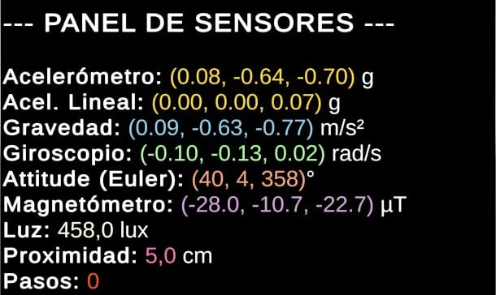
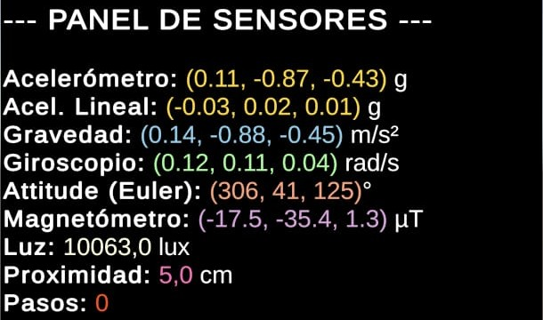

# Práctica 10 - Monitor de Sensores

- **Author**: Himar Edhey Hernández Alonso
- **Subject**: Interfaces Inteligentes

## Introducción

En esta práctica se han estudiado los disntintos sensores disponibles en un dispositivo móvil Android, así como su uso en Unity.

## Sensores

*Crear una aplicación en Unity que muestre en la UI los valores de todos los sensores disponibles en tu móvil. Incluir en el Readme una medida de los valores en el laboratorio y otra en el jardin de la ESIT.*

En este caso se ha creado un script que permite ver los sensores disponibles en el dispositivo. Luego, se han habilitado los mismos para obtener sus datos en tiempo real y mostrarlos en pantalla.

[Sensores en Unity](SensorManager.cs)

### Sensores Implementados

Al hacer debug de los sensores disponibles en el dispositivo, se pueden observar los siguientes:

Por lo tanto, se han implementado los siguientes sensores en la aplicación:

- **Acelerómetro:** Aceleración bruta (incluye gravedad).
- **Aceleración Lineal:** Aceleración del usuario (excluye gravedad).
- **Gravedad:** Vector de gravedad aislado.
- **Giroscopio:** Velocidad angular de rotación.
- **Attitude (Orientación):** Rotación absoluta del dispositivo en el espacio.
- **Magnetómetro:** Campo magnético terrestre (brújula).
- **Sensor de Luz:** Iluminancia ambiental.
- **Proximidad:** Distancia a objetos cercanos (sensor frontal).
- **Contador de Pasos:** Número de pasos dados por el usuario.

## Tabla de Mediciones

A continuación se comparan los valores obtenidos en dos entornos con características físicas distintas:

1. **Laboratorio:** Entorno interior controlado, luz artificial, posibles interferencias magnéticas.

| Sensor | Valor | Unidad |
| :--- | :--- | :--- |
| **Acelerómetro** | `0.08, -0.64, -0.70` | g |
| **Acel. Lineal** | `0.00, 0.00, 0.07` | g |
| **Gravedad** | `0.09, -0.63, -0.77` | m/s² |
| **Giroscopio** | `-0.10, -0.13, 0.02` | rad/s |
| **Attitude (Euler)**| `40, 4, 358` | ° (grados) |
| **Magnetómetro** | `-28.0, -10.7, -22.7` | µT |
| **Luz** | `458,0` | lux |
| **Proximidad** | `5,0` | cm |
| **Pasos** | `0` | pasos |

2. **Jardín:** Entorno exterior, luz natural, campo magnético terrestre más limpio.

| Sensor | Valor | Unidad |
| :--- | :--- | :--- |
| **Acelerómetro** | `0.11, -0.87, -0.43` | g |
| **Acel. Lineal** | `-0.03, 0.02, 0.01` | g |
| **Gravedad** | `0.14, -0.88, -0.45` | m/s² |
| **Giroscopio** | `0.12, 0.11, 0.04` | rad/s |
| **Attitude (Euler)** | `306, 41, 125` | ° (grados) |
| **Magnetómetro** | `-17.5, -35.4, 1.3` | µT |
| **Luz** | `10063,0` | lux |
| **Proximidad** | `5,0` | cm |
| **Pasos** | `0` | pasos |

### Conclusiones

Podemos observar varias diferencias notables entre las mediciones tomadas en el laboratorio y en el jardín:

- Variación de Luminosidad (Lux): El sensor de luz confirma drásticamente el cambio de entorno. Se observa un incremento de casi 20 veces más en la intensidad lumínica al pasar del laboratorio (458 lux, iluminación artificial) al exterior (10063 lux, luz solar), lo que valida el correcto funcionamiento del fotómetro.

- Orientación del Dispositivo (Attitude/Acelerómetro): Los vectores de gravedad y los ángulos de Euler indican que el dispositivo no se encontraba en la misma posición física en ambas tomas.

  En el laboratorio, el dispositivo estaba casi vertical o inclinado lateralmente (Gravedad en ejes Y/Z).En el jardín, la orientación cambió significativamente (ver Attitude: 40° vs 306° en el primer eje), lo que altera la interpretación de los componentes vectoriales (X, Y, Z) de los sensores magnéticos y de aceleración.

- Estabilidad de la Muestra: En ambos casos, la Aceleración Lineal es prácticamente nula (cercana a 0 g) (porque el dispositivo estaba quieto a la hora de sacar la captura), y el Giroscopio reporta valores residuales, lo que confirma que las mediciones se tomaron con el dispositivo en estado estático.

- Entorno Magnético: Aunque la magnitud del campo magnético es similar, los vectores difieren debido a la rotación del dispositivo mencionada anteriormente. Las lecturas del jardín presentan menos ruido potencial de equipos electrónicos, aunque para una comparación estricta de "limpieza magnética" deberíamos alinear el dispositivo exactamente en la misma orientación geográfica en ambos casos.

## Orientación con GPS

*Crear una apk que oriente alguno de los guerreros de la práctica mirando siempre hacia el norte, avance con una aceleración proporcional a la del dispositivo y lo pare cuando el dispositivo esté fuera de un rango de latitud, longitud dado. El acelerómetro nos dará la velocidad del movimiento. A lo largo del eje z (hacia adelante y hacia atrás), se produce el movimiento inclinando el dispositivo hacia adelante y hacia atrás. Sin embargo, necesitamos invertir el valor z porque la orientación del sistema de coordenadas corresponde con el punto de vista del dispositivo. Queremos que la rotación final coincida con la orientación cuando mantenemos el dispositivo en la posición Horizontal Izquierda. Esto ocurre cuando la izquierda en la posición vertical ahora es la parte inferior. Aplicar las rotaciones con interpolación  Slerp en un quaternion.*

Para lograr crear esta apk primero añadí en una escena nueva el guerrero a controlar. Luego, creé un script que permitiera obtener la orientación del dispositivo y mover al guerrero hacia el norte.

[Face North](FaceNorth.cs)

Por último, se limitó el movimiento del guerrero a un rango específico de latitud y longitud. Así como se añadió una aceleración proporcional a la inclinación del dispositivo.

[Warrior Movement](WarriorMovement.cs)

Para ambos es necesario el uso del GPS, se usa un IEnumerator para esperar a que el servicio de localización esté habilitado y obtener las coordenadas. Ajustamos la latitud y longitud permitida para el movimiento del guerrero a la zona de Tenerife y movemos el guerrero solo si el dispositivo está dentro de ese rango. Para el movimiento, se obtiene la inclinación del dispositivo a lo largo del eje z y se aplica una fuerza proporcional a esa inclinación para mover al guerrero hacia adelante o atrás, tal y como se describe en el enunciado. Además, se utiliza Slerp (tal y como se pide) para suavizar la rotación del guerrero hacia el norte.

Por otra parte, se ha creado una GUI que muestra la latitud y longitud actuales del dispositivo, así como un mensaje que indica si el guerrero puede moverse o no según su ubicación para hacer debugging, por ello queda comentado.

